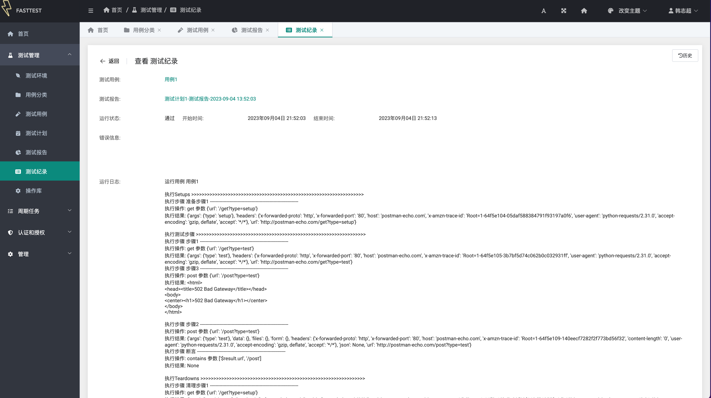

# FastTest
基于Django的测试平台

> 目前仅基于Django Admin + SimpleUI实现了基础功能

登录页


首页


用例列表


用例编辑


测试报告


测试纪录


## 特性
- 自定义测试库，可以支持接口测试，WebUI、AppUI测试，数据库测试等多种测试


## 使用方法

1. 下载或克隆当前项目
```shell
git clone https://github.com/hanzhichao/fasttest
```

2. 安装依赖

```shell
cd fasttest
pip install -r requirements.txt
```
3. 运行开发服务器

```shell
python manage.py runserver
```
4. 访问 http://localhost:8000/admin  用户名/密码 superhin/abc123


## 参考
- [拖动排序查看](https://github.com/jazzband/django-admin-sortable)
- [fontawesome图标](https://fontawesome.com/search?o=r&m=free)
- [simpleui文档](https://simpleui.72wo.com/docs/simpleui/QUICK.html)
- [Element文档](https://element.eleme.cn/#/zh-CN/component/)
- [django-rest-framework](https://www.django-rest-framework.org/)
- [级联选择插件](https://pypi.org/project/django-cascading-dropdown-widget/)
- [导入导出插件](https://django-import-export.readthedocs.io/en/latest/getting_started.html)
